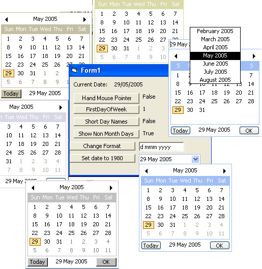



## Themed Date Picker / Calendar control

### Description

A datepicker. See screenshot. Supports themes, different date formats, hand cursor, short day names, non month days and first day of week assignment. The main advantage of this code is that it is a single usercontrol, not an OCX.

Update: Changed the test to see if themes were enabled for 2000 users.
 
### More Info
 

             |
---                |---
**Submitted On**   |2005-06-24 13:02:08
**By**             |[GDuncan](https://github.com/Planet-Source-Code/PSCIndex/blob/master/ByAuthor/gduncan.md)
**Level**          |Intermediate
**User Rating**    |5.0 (85 globes from 17 users)
**Compatibility**  |VB 6\.0
**Category**       |[Custom Controls/ Forms/  Menus](https://github.com/Planet-Source-Code/PSCIndex/blob/master/ByCategory/custom-controls-forms-menus__1-4.md)
**World**          |[Visual Basic](https://github.com/Planet-Source-Code/PSCIndex/blob/master/ByWorld/visual-basic.md)
**Archive File**   |[Themed\_Dat1905516252005\.zip](https://github.com/Planet-Source-Code/gduncan-themed-date-picker-calendar-control__1-61001/archive/master.zip)

